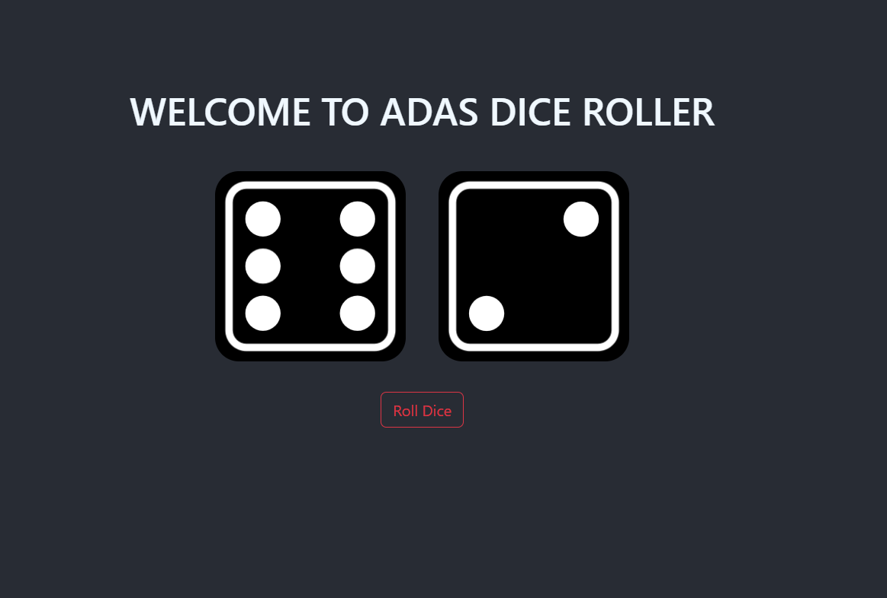

**README for React Dice Game with Bootstrap**

## Dice Game - React Edition with Bootstrap

Welcome to the React Dice Game repository! This is a simple web application built with React and Bootstrap that simulates rolling dice. The game allows you to roll a specified number of dice with a certain number of sides and displays the results. It's a fun little project to try out your luck and enjoy some random outcomes!

### How to Play

1. Ensure you have a modern web browser with JavaScript support.
2. Clone or download this repository to your local machine.
3. Open a terminal window and navigate to the project's root directory.
4. Install the required dependencies by running `npm install`.
5. Start the development server by running `npm start`.
6. Open your web browser and navigate to `http://localhost:3000`.
7. You will see a stylish web page with options to input the number of dice and the number of sides for each die you want to roll.
8. Click the "Roll Dice" button after providing the desired inputs.
9. The application will then simulate the dice rolls and display the results on the page in a visually appealing format.

### Folder Structure

The project's folder structure is organized as follows:

```
dice-game-react/
  ├── public/
  │   ├── index.html
  │   └── ...
  ├── src/
  │   ├── components/
  │   │   ├── Dice.js
  │   │   └── ...
  │   ├── App.js
  │   ├── index.js
  │   └── ...
  ├── package.json
  ├── README.md
  └── ...
```

### Additional Dependencies

This project utilizes Bootstrap to enhance the user interface and make it more responsive. The required Bootstrap package is already included in the project's dependencies.


### License

This project is licensed under the [MIT License](LICENSE), which means you can modify and distribute the code as long as you retain the original license text.

### Acknowledgments

- The Dice Game project was inspired by the joy of playing dice games and learning React and Bootstrap.
- Thanks to all contributors who helped improve the project and fix issues.

Have fun rolling the dice! 🎲

<br>
<br>
<br>
<br>
<br>
<br>
 
. 

